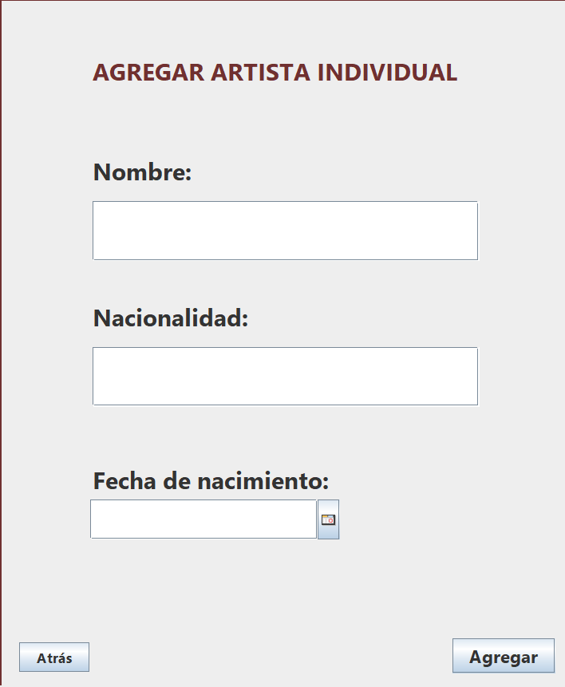

# Pantalla de Agregar Artista Individual
## Elaborado con Java Swing

Los componentes utilizados fueron:
* 4 JLabels para el título, y los atributos como el nombre, la nacionalidad y la fecha de nacimiento
* 2 TextFields para que el usuario pueda ingresar los datos.
* 1 JDateChooser para elegir la fecha en forma de calendario.
* 2 botones, uno para regresar a la pantalla de atrás y otro para agregar al artista y cargarlo a la base de datos.
