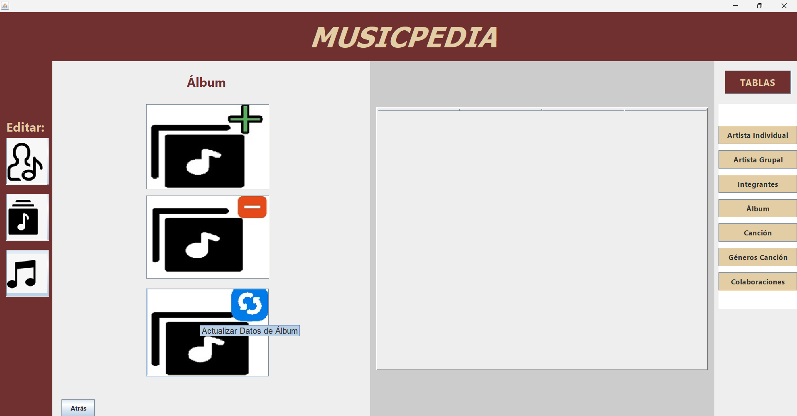

# Pantalla de Opciones del Álbum
## Elaborado con Java Swing

Se pueden seleccionar las siguiente opciones:
* Agregar un Álbum
* Eliminar un Álbum
* Modificar los datos del Álbum

También se oberva en la parte izquierda de las pantallas, los íconos
del artista, del álbum y de las canciones. 

En la parte de la derecha se puede seleccionar la tabla que se quiera
visualizar, las opciones son:
* Artista individual
* Artista grupal
* Integrantes de un grupo 
* Álbum
* Canciones
* Géneros de una canción
* Colaboraciones

