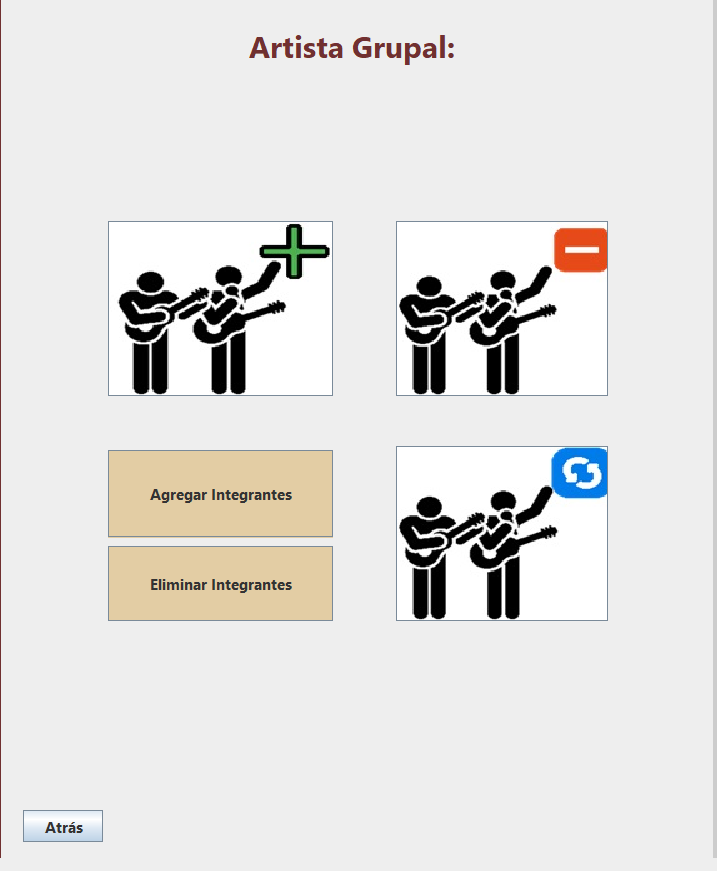

# Pantalla de las opciones del Artista Grupal
## Elaborado con Java Swing

Se observan cuatro íconos, que son los botones que te llevarán a las pantallas de:
* Agregar un nuevo artista grupal
* Eliminar un artista grupal
* Modificar los datos del artista grupal
* Agregar integrantes al grupo
* Eliminar integrantes del grupo